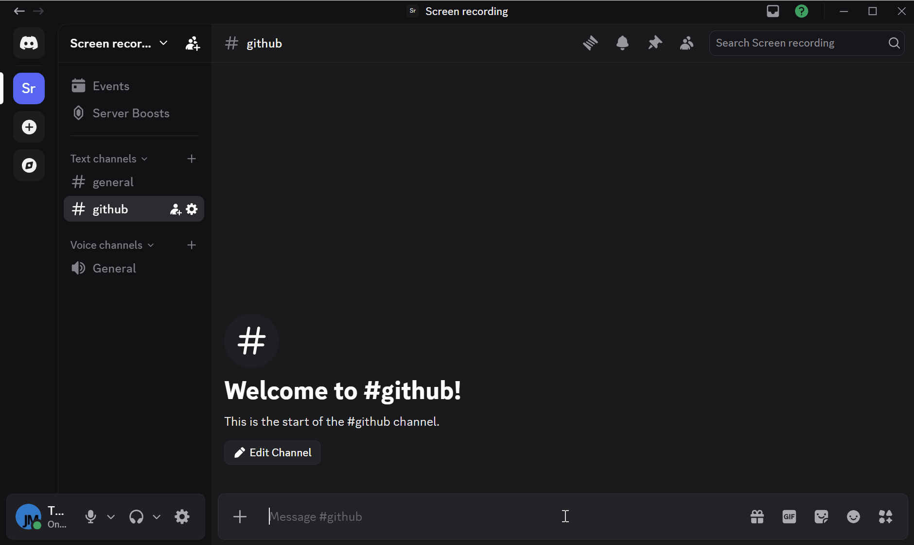
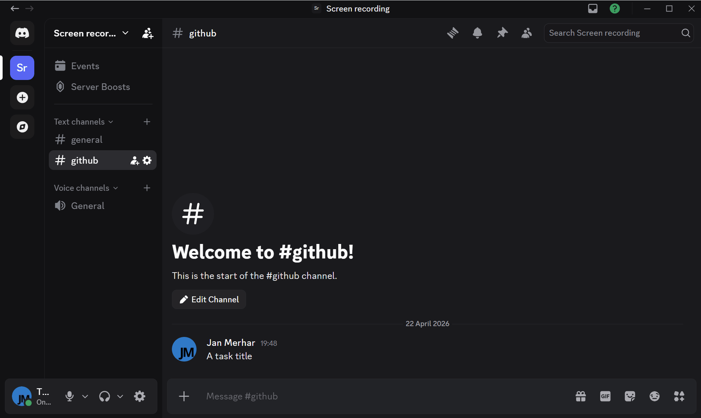
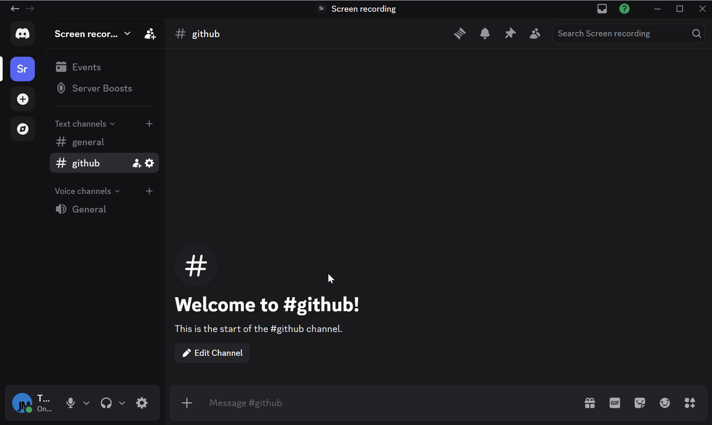
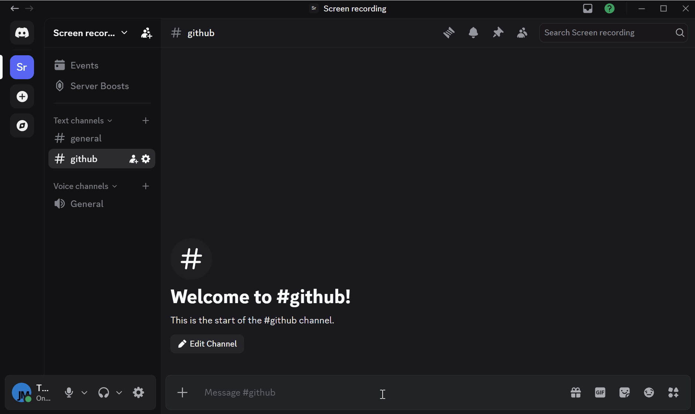
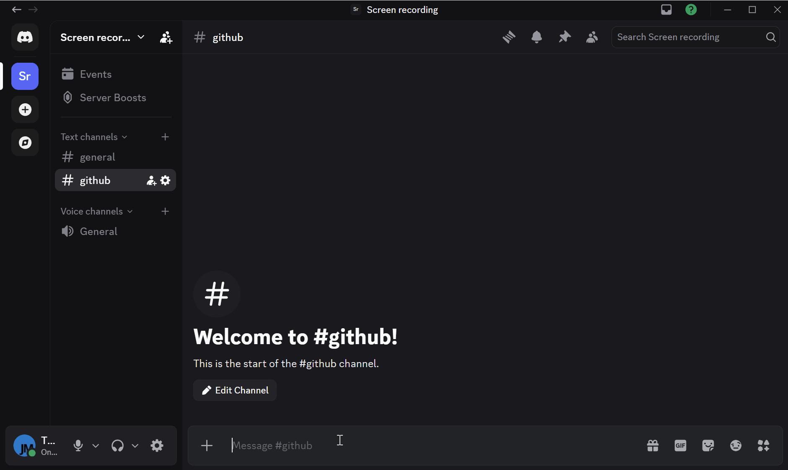
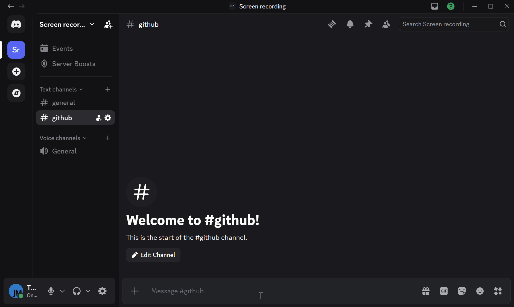

# Productivity Bot

> **Public beta is live.** [Add the bot to your server](https://discord.com/oauth2/authorize?client_id=865552224825245697).

A Discord productivity bot for individuals and teams — works in servers and DMs.

It brings shared to-dos, personal reminders, habits, Pomodoro focus sessions, and Toggl time tracking into one bot, with support for both server channels and DMs. The current bot covers to-dos with custom lists, assignees, and status tracking, reminders with flexible schedules and private destinations, habits with optional reminders, Pomodoro timers with voice playback, and Toggl timer, project, and tag management.

What makes it more useful than a plain command pack is the workflow design: messages can be turned into reminders, todos, Pomodoros, or timers from context-menu shortcuts, shared server workflows and private DM workflows both exist in the same bot, and common actions use buttons, selects, and modals instead of pushing everything through raw command syntax.



## Commands

### Message shortcuts



Use Discord message context actions to turn existing conversations into work without retyping content. These shortcuts are the fastest way to create reminders, todos, focus sessions, or timers from messages already in front of you.

- `Create Reminder`
- `Add to Todo`
- `Add to Personal Todo`
- `Start Pomodoro`
- `Start Timer`

### To-dos



The todo commands cover both personal and shared task management. You can create tasks, organize them into lists, assign ownership, update status, and keep server-level or personal workflows separated.

- **`/todo overview`**: `sort?`, `status?`, `assignee?`, `visibility?`
- **`/todo add`**: `todo`, `description?`, `due?`, `list?`, `status?`, `assignee?`, `notify_assignee?`, `visibility?`
- **`/todo show`**: `todo`, `visibility?`
- **`/todo edit`**: `todo`, `visibility?`
- **`/todo status`**: `todo`, `status`, `visibility?`
- **`/todo assign`**: `todo`, `assignee`, `visibility?`
- **`/todo complete`**: `todo`, `visibility?`
- **`/todo delete`**: `todo`, `visibility?`
- **`/list show`**: `sort?`, `status?`, `list?`, `assignee?`, `visibility?`
- **`/list directory`**: `scope?`, `visibility?`
- **`/list create`**: `name`, `scope?`, `visibility?`
- **`/list edit`**: `list`, `name`, `visibility?`
- **`/list clear`**: `list?`, `visibility?`
- **`/list delete`**: `list`, `visibility?`

### Reminders



Reminder commands handle both recurring and one-off scheduling. They support flexible schedules, private or channel destinations, and pause or resume flows when plans change.

- **`/reminder add`**: `reminder`, `schedule`, `add_pings?`, `description?`, `expires?`, `destination?`, `visibility?`
- **`/reminder list`**: `destination?`, `sort?`, `status?`, `visibility?`
- **`/reminder show`**: `reminder`, `visibility?`
- **`/reminder edit`**: `reminder`, `visibility?`
- **`/reminder pause`**: `reminder`, `until?`, `visibility?`
- **`/reminder resume`**: `reminder`, `visibility?`
- **`/reminder remove`**: `reminder`, `visibility?`

### Habits



Habit tracking is meant for lightweight daily consistency rather than heavy journaling. You can create habits, review progress, mark outcomes, and optionally attach reminders to keep the routine active.

- **`/habit add`**: `habit`, `description?`, `reminder?`, `destination?`, `visibility?`
- **`/habit list`**: `status?`, `sort?`, `scope?`, `visibility?`
- **`/habit show`**: `habit`, `visibility?`
- **`/habit mark`**: `habit`, `status?`, `date?`, `visibility?`
- **`/habit edit`**: `habit`, `visibility?`
- **`/habit delete`**: `habit_name`, `visibility?`

### Pomodoro


Pomodoro commands handle focus and break sessions directly in Discord. They support active session control, time extensions, and voice-channel playback for users who want the bot to participate in focus rooms.

- **`/pomodoro start`**: `mode?`, `duration?`, `voice_channel?`, `autojoin?`, `visibility?`
- **`/pomodoro active`**: `visibility?`
- **`/pomodoro pause`**: `visibility?`
- **`/pomodoro resume`**: `visibility?`
- **`/pomodoro extend`**: `minutes?`, `visibility?`
- **`/pomodoro stop`**: `visibility?`

### Toggl



The Toggl commands let Discord act as a lightweight time-tracking surface. You can start and stop timers, inspect active entries, manage projects and tags, and insert time manually when needed.

- **`/toggl account`**: `visibility?`
- **`/toggl timer start`**: `project?`, `description?`, `billable?`, `visibility?`
- **`/toggl timer active`**: `visibility?`
- **`/toggl timer stop`**: `visibility?`
- **`/toggl timer insert`**: `start`, `stop`, `project?`, `description?`, `tags?`, `billable?`, `visibility?`
- **`/toggl timer list`**: `visibility?`
- **`/toggl project create`**: `name`, `visibility?`
- **`/toggl project list`**: `visibility?`
- **`/toggl project get`**: `project`, `visibility?`
- **`/toggl tag add`**: `name`, `visibility?`
- **`/toggl tag show`**: `tag`, `visibility?`

### Other commands

These commands cover the surrounding bot experience rather than one specific workflow. Use them for setup, general bot info, and direct feedback through bug reports or feature requests.

- **`/info`**
- **`/settings set timezone`**
- **`/settings set toggl`**
- **`/bug report`**: `visibility?`
- **`/feature request`**: `visibility?`

## Setup

1. Create a root `.env` file. The current setup uses variables like:

```bash
DISCORD_TOKEN=
DEV_MODE=
DEV_GUILD_ID=
TICK_DISABLED=
MONGO_URI=
OPENAI_API_KEY=
POMODORO_AUDIO_VOLUME=
ALIAS_DISABLED=
```

2. Install dependencies:

```bash
pip install -r packages.pip
```

3. Start the bot:

```bash
python main.py
```

## Development

When `DEV_MODE=true` and `DEV_GUILD_ID` is set, the bot uses dev-mode command sync. In development mode commands are synced on each startup by default.

```bash
DEV_MODE=true
DEV_GUILD_ID=123456789012345678
```
